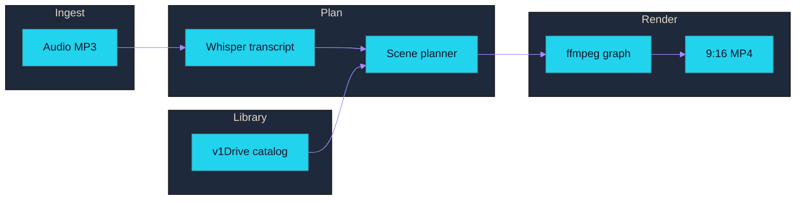

<!-- WeatherV1-next README — SVG banners in docs/readme-assets/ render on GitHub via raw paths -->

<p align="center">
  
</p>

<p align="center"><sub><strong>Animated SVG</strong> — gradients, waves, rain, and drifting lights use <strong>SMIL</strong> (<code>&lt;animate&gt;</code>, <code>&lt;animateTransform&gt;</code>, <code>&lt;animateMotion&gt;</code>). Works in GitHub’s README image proxy and modern browsers — no GIFs, no scripts.</sub></p>

<p align="center">
  <a href="https://nextjs.org/"></a>
  <a href="https://react.dev/"></a>
  <a href="https://www.typescriptlang.org/"></a>
  <a href="https://vitest.dev/"></a>
</p>

<p align="center">
  <a href="https://ffmpeg.org/"></a>
  
  
  
</p>

<p align="center"><strong>Spoken weather narration → transcribed → scene-planned → ffmpeg’d into a broadcast-style 9:16 MP4 — all local.</strong></p>

---

## Signal flow

<p align="center">
  
</p>

<sub>Pulses on each stage, marching dashes on connectors, and colored dots riding the wires — all SMIL-driven.</sub>

---

## What this is

**WeatherV1-next** is the **Next.js / TypeScript** port of a weather **forecast video generator**: record narration → **OpenAI Whisper** transcribes → a **scene-aware planner** picks clips from your local catalog (`v1Drive`) → **ffmpeg** renders **vertical 9:16 MP4**. The UI is a studio shell over a job queue and filesystem-backed outputs.

---

## Pipeline diagram



---

## Why not serverless-by-default?

Long-lived **Node**, **ffmpeg subprocesses**, **disk**, **multi-minute encodes**, and **large uploads** push against typical FaaS limits. Run it on a **real VM/container with ffmpeg**, or on the **desktop** via Electron. Full rationale: [`docs/DESIGN_DEPLOYMENT.md`](docs/DESIGN_DEPLOYMENT.md).

**Optional Cloudflare R2:** catalog and media can mirror to R2 via a Worker gateway (short-lived credentials; local-first ffmpeg). See [`docs/R2_PULUMI_HANDOFF.md`](docs/R2_PULUMI_HANDOFF.md).

**Docs router + code map:** [`docs/DOCS_INDEX.md`](docs/DOCS_INDEX.md). Agent guide: [`AGENTS.md`](AGENTS.md). Goal-driven sessions: `/weatherv1-goal`.

---

### Local dev (web)

**Needs:** Node **20+**, **ffmpeg** + **ffprobe** on `PATH`, and a `v1Drive/` media tree.

```bash
npm install
cp .env.example .env.local    # OPENAI_API_KEY required; GEMINI_API_KEY optional
npm run dev                   # http://localhost:3000
```

In dev, keep **`v1Drive/` as a sibling** of this repo (same parent folder) so catalog paths resolve.

---

### Desktop (Electron)

Same Next backend inside Electron: native pickers, **`ffmpeg-static` / `ffprobe-static`**, **per-launch session token** on `/api/*` ([`src/proxy.ts`](src/proxy.ts)), **user-chosen workspace** (no forced sibling `v1Drive/` layout).

```bash
npm install
npm run electron:dev          # http://127.0.0.1:3765
npm run electron:make         # out/ — .zip (macOS) · Squirrel (Windows)
```

Icons: `build/icon.icns` · `build/icon.ico` · [regeneration](docs/ELECTRON.md#app-icons). Ops & boundaries: [`docs/ELECTRON.md`](docs/ELECTRON.md).

**Published installers:** Push a `v*` tag — [`.github/workflows/desktop.yml`](.github/workflows/desktop.yml) builds `WeatherV1-Setup.exe` on Windows (`--arch=x64`); [`.github/workflows/desktop-publish-release.yml`](.github/workflows/desktop-publish-release.yml) uploads it to Cloudflare R2 via the S3 API. Public URLs: `https://<worker-host>/downloads/windows/{latest,<tag>}/WeatherV1-Setup.exe`. macOS is built locally only (see [`docs/RELEASE_CONVENTION.md`](docs/RELEASE_CONVENTION.md)). The download/pitch-deck page is deployed by [`.github/workflows/pitch-deck.yml`](.github/workflows/pitch-deck.yml) to Cloudflare Pages (`weatherv1-download.pages.dev`). Full procedure: [`docs/RELEASE_CONVENTION.md`](docs/RELEASE_CONVENTION.md) or invoke `/weatherv1-release`.

---

### Docker

```bash
docker compose up -d --build
```

Mounts: **`../v1Drive` → `/app/v1Drive`**, **`./runtime` → `/app/weatherV1-next/runtime`** — see [`docker-compose.yml`](docker-compose.yml).

---

## Environment

| Variable | Required | Purpose |
| --- | --- | --- |
| `OPENAI_API_KEY` | **Yes** | Whisper + GPT planning |
| `GEMINI_API_KEY` | No | Gemini vision path; else GPT‑4o‑mini vision |
| `FFMPEG_PATH` / `FFPROBE_PATH` | No | Override binaries |
| `PORT` / `HOSTNAME` | No | Compose defaults `3000` / `0.0.0.0` |

Template: [`.env.example`](.env.example).

---

## Scripts

| Script | Runs |
| --- | --- |
| `npm run dev` | Next dev |
| `npm run build` | Production build (`standalone` for Electron) |
| `npm run start` | `next start` |
| `npm test` | Vitest |
| `npm run electron:dev` | Electron + Next dev |
| `npm run electron:build` | Build + standalone prep + Forge package |
| `npm run electron:make` | … + Forge make |

---

## Tests

```bash
npm test
```

---

## Credits

**Author:** Barmoshe · `weatherv1-next` ([`package.json`](package.json)).

README visuals live under [`docs/readme-assets/`](docs/readme-assets/) (SVG with subtle SMIL — friendly to GitHub’s image proxy). Structure inspired by the **claude-creative-stack** workspace (dense tables + one diagram + clear rails).

---

<p align="center">
  <sub><code>vertical video · local-first media</code></sub>
</p>
