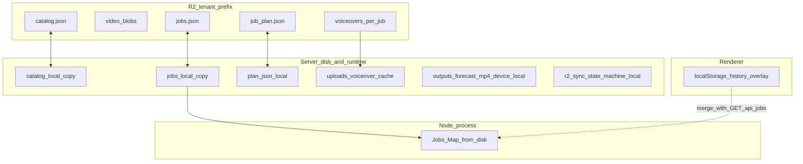

# Cloudflare R2 storage plan for WeatherV1 Electron

## Goal

WeatherV1 is an Electron standalone Next.js app. The app should keep rendering and active work local, but use Cloudflare as the remote storage layer for:

- `catalog/catalog.json`
- source videos
- voiceovers (input audio per job; lazy-hydrated into `runtime/uploads` before render when missing locally)
- posters/previews if useful

**Rendered forecast MP4** (`runtime/outputs/forecast_<jobId>.mp4`) is **device-local only** — it is not uploaded to R2 and not hydrated from R2. Each machine renders its own file.

This is **not** a plan to deploy the app to a specific cloud VM vendor, Vercel, or any hosted server. The app remains local-first.

---

## Target architecture

```txt
WeatherV1 Electron app
  └─ local Next.js backend
       ├─ reads/writes local workspace
       ├─ renders with local ffmpeg
       └─ syncs media with Cloudflare

Cloudflare
  ├─ R2 bucket: media object storage
  ├─ Worker: auth + access gateway
  ├─ Temporary R2 credentials or presigned URLs
  └─ optional KV/D1: license/user/session metadata
```

The Electron app must **never ship permanent R2 credentials**.

---

## Bucket layout

Use one R2 bucket first:

```txt
weatherv1-media/
└── tenants/
    └── <tenant-id>/
        ├── catalog/
        │   └── catalog.json
        ├── videos/
        │   ├── vid_001_example.mp4
        │   └── ...
        ├── voiceovers/
        │   └── <job-id>/
        │       └── <audio-basename>.mp3   # same stem as runtime/uploads (UUID + ext)
        ├── jobs/
        │   ├── jobs.json
        │   └── <job-id>/
        │       └── plan.json
        ├── outputs/                        # legacy: older builds uploaded forecast MP4 here; new builds do not
        │   └── ...
        └── posters/
            ├── vid_001.jpg
            └── ...
```

Use tenant prefixes even if the first version has only one customer. It avoids redesign later.

---

## Local-first rule

The app should continue using the existing local workspace:

```txt
v1Drive/weather/
├── notouch!/catalog.json
├── videos/
└── music/

runtime/
├── uploads/
├── outputs/
└── cache/
```

R2 is the remote sync/source-of-truth layer, but ffmpeg should work from local files.

Do not make ffmpeg depend on remote URLs in v1. Download/cache source media locally first.

---

## Runtime persistence and authority layers

Use one mental stack so multi-device behavior stays predictable:



| Layer | Artifact | Authority when R2 enabled | Notes |
| --- | --- | --- | --- |
| Cloud | `catalog/catalog.json` | **R2** after sync; local is cache | ETag conflict flow exists (`pushCatalogToR2`). |
| Cloud | `jobs/jobs.json` | **R2** for shared registry | Mirror is fire-and-forget `putR2Text`; multi-writer races possible — see Future hardening below. |
| Cloud | `jobs/<id>/plan.json` | **R2** once mirrored | Hydrate on `GET /api/plan/[jobId]`. |
| Cloud | Voiceover blob | **R2**; local upload is cache | Immutable per job id + filename. Lazy hydrate before render when local missing/empty. |
| Cloud | Source videos | **R2** keys in catalog | Materialize to workspace via sync. |
| Local only | `forecast_<job>.mp4` | **This device** | Never cloud per product decision. |
| Local only | `r2-sync-state.json` | **This device** | Etags, conflicts, upload progress — not shared. |
| Process | Jobs `Map` | **Disk `jobs.json`** after load | Invalidate via `resetJobsStore` after R2 hydrate. |
| Browser | `weatherv1.history` | **Derived** | Merged with server list in `useLocalHistory`; server wins on conflicts for shared ids. |

**Cross-device `completed` semantics:** Treat `JobRecord.status` and `output_url` as **global narrative state** (“this job finished somewhere”), not “this Mac has the MP4.” `GET /api/outputs/[filename]` may return **404** until this device renders; the UI should explain and offer re-render.

### JSON on R2 — practices

Apply to catalog, `jobs.json`, and plan JSON blobs:

- **Whole-object semantics:** read → merge in app → PUT full body.
- **Optimistic concurrency:** for hot mutable JSON, prefer GET + ETag → PUT `If-Match`; on failure, re-read or surface conflict to the user (catalog tracks remote etag in `r2-sync-state`; `jobs.json` mirror does not yet).
- **Validate before PUT:** schema parse (e.g. Zod) so corrupt JSON never replaces cloud.
- **Headers:** `Content-Type: application/json; charset=utf-8` and `Cache-Control: no-cache` for authoritative documents (`putR2Text`).
- **Atomic local writes:** temp file + rename before trusting disk (`jobs.json`, catalog) so crashes do not leave torn JSON.
- **Change detection:** prefer server **ETag** or canonical stringify; avoid relying on arbitrary `JSON.stringify` key order.
- **Metadata:** prefer structured fields **inside JSON** over `x-amz-meta-*` for non-ASCII or rich data.
- **Size:** keep single JSON objects bounded; shard history if `jobs.json` grows without bound long-term.

### Ops: legacy `outputs/` objects in R2

Older builds uploaded `tenants/<tenant>/outputs/<jobId>/forecast.mp4`. New code **does not** write these keys. For cost and clarity, use a [bucket lifecycle rule](https://developers.cloudflare.com/r2/buckets/bucket-lifecycle/) or a one-off delete for `**/outputs/**` under tenant prefixes after rollout.

### Future hardening: `jobs.json` concurrency

Optional: GET + ETag for `jobs/jobs.json` and PUT with `If-Match`, plus conflict UX if two machines mutate the catalog of jobs concurrently (similar to catalog pattern).

---

## Security model

### Do not do this

```txt
Electron app contains:
- R2_ACCESS_KEY_ID
- R2_SECRET_ACCESS_KEY
- global bucket token
```

Anything bundled in Electron should be treated as extractable.

### Recommended model

```txt
1. User opens Electron app
2. App authenticates with Cloudflare Worker using license/user token
3. Worker verifies tenant/user permissions
4. Worker returns short-lived temporary R2 credentials scoped to tenant prefix
5. Electron syncs files directly with R2
6. Credentials expire and must be refreshed
```

The Worker owns the real Cloudflare/R2 authority. The desktop app only receives temporary, scoped access.

### Access scope

Each user/install should only access:

```txt
tenants/<tenant-id>/*
```

Never grant access to the whole bucket unless it is an internal-only prototype.

### Credential lifetime

Recommended defaults:

```txt
Temporary credentials TTL: 15-60 minutes
Presigned single-object URLs: 5-15 minutes
Local app session/license token: longer-lived, stored securely by Electron
```

Use Electron `safeStorage` or OS keychain-style storage for the app session/license token. Do not use it to store global R2 secrets.

---

## Access strategy

### Option A — temporary R2 credentials

Best for real sync.

Use this when the app needs to upload/download many files:

```txt
videos/*
voiceovers/*
catalog/catalog.json
jobs/jobs.json
jobs/*/plan.json
# outputs/* may still exist for legacy tenants; new builds do not write forecast MP4 to R2
```

Pros:

- efficient for many files
- direct Electron-to-R2 transfer
- Worker does not proxy large video files
- can be scoped and short-lived

Cons:

- requires implementing credential refresh
- must carefully scope access

### Option B — presigned URLs

Best for one-off operations.

Use this when the app needs exactly one operation:

```txt
PUT one voiceover
GET one video
# optional legacy: PUT rendered output (not used by current app — renders stay local)
DELETE one object
```

Pros:

- simple mental model
- one URL = one operation
- low blast radius

Cons:

- annoying for bulk sync
- Worker must generate many URLs

### Recommendation

Use temporary credentials for the sync engine. Keep presigned URLs as a later fallback for share/download links.

---

## Data ownership rules

| Asset | Local behavior | R2 behavior | Access |
| --- | --- | --- | --- |
| Catalog JSON | edited locally | synced to `catalog/catalog.json` | private |
| Source videos | cached locally for ffmpeg | stored in `videos/` | private |
| Voiceovers | stored in `runtime/uploads` (cache) | stored under `voiceovers/<job-id>/` | private |
| Rendered forecast MP4 | stored in `runtime/outputs` only | **not** mirrored to R2 | device-local |
| Posters/previews | stored in cache | optional `posters/` | can be public later |

---

## Conflict handling

The catalog is the highest-risk file because it is mutable.

Use simple version metadata in v1:

```json
{
  "version": "2026-05-13T12:00:00.000Z",
  "updated_at": "2026-05-13T12:00:00.000Z",
  "videos": []
}
```

Before pushing local catalog to R2:

1. fetch remote metadata/version
2. compare with last synced version
3. if remote changed, block overwrite and ask user to pull/merge
4. if no conflict, upload local catalog

Avoid silent last-write-wins for catalog edits.

For videos and voiceovers, use immutable filenames and avoid overwrites. Forecast MP4 outputs stay local only and are not part of R2 sync.

---

## Caching rules

### Catalog

Do not cache aggressively.

```txt
Cache-Control: no-cache
```

or short TTL:

```txt
Cache-Control: max-age=30
```

### Videos / voiceovers

Use immutable object keys where possible. Forecast render outputs are not stored in R2.

```txt
Cache-Control: public, max-age=31536000, immutable
```

This only works if files are never overwritten in place.

---

## Repo integration plan

### New storage abstraction

Add:

```txt
src/server/storage/media-store.ts
```

Suggested interface:

```ts
export interface MediaStore {
  readCatalog(): Promise<string>;
  writeCatalog(raw: string): Promise<void>;
  uploadVideo(localPath: string, key: string): Promise<void>;
  downloadVideo(key: string, localPath: string): Promise<void>;
  uploadVoiceover(localPath: string, key: string): Promise<void>;
  uploadOutput(localPath: string, key: string): Promise<void>;
  objectExists(key: string): Promise<boolean>;
}
```

Implementations:

```txt
LocalMediaStore
R2MediaStore
```

### Cloudflare auth client

Add:

```txt
src/server/cloudflare/auth-client.ts
```

Responsibilities:

- call Worker with app session/license token
- receive temporary credentials
- refresh before expiry
- expose R2/S3-compatible client config to `R2MediaStore`

### Sync service

Add:

```txt
src/server/sync/media-sync.ts
```

Responsibilities:

- push catalog
- pull catalog
- upload missing videos
- download missing videos
- upload voiceovers after transcription
- lazy-hydrate voiceovers from R2 before render when the local file is missing
- report progress to UI

---

## Existing repo touch points

### Catalog video import

Current flow copies video to local videos dir, probes it, writes catalog, and generates poster.

Keep that flow. After successful local import:

```txt
upload video to R2
upload updated catalog to R2
optional upload poster to R2
```

Likely touch point:

```txt
src/app/api/catalog/videos/route.ts
```

### Voiceover import/transcription

Current flow writes audio into `runtime/uploads`, transcribes, then creates a job.

After successful save/transcribe:

```txt
upload voiceover to R2
store remote key in plan/job metadata if needed
```

Likely touch point:

```txt
src/app/api/transcribe/route.ts
```

### Render output

Current worker renders to local `runtime/outputs/forecast_<jobId>.mp4`. That file **stays on disk only**; it is **not** uploaded to R2. Before rendering, when R2 is configured, the worker **lazy-hydrates** the voiceover from `voiceovers/<jobId>/<audioBasename>` if `runtime/uploads` does not already have a non-empty file.

`JobRecord.status === completed` and `output_url` still describe the **basename** of the local output file; on another device they indicate “finished elsewhere” until this machine renders (preview may 404 on `GET /api/outputs/...`).

Likely touch points:

```txt
src/server/jobs/worker.ts
src/server/sync/r2/hydrate-voiceover.ts
```

---

## Cloudflare Worker plan

Create a separate Worker project, not inside the Electron bundle.

Endpoints:

```txt
POST /auth/session
POST /r2/temporary-credentials
POST /r2/presign
GET  /health
```

Minimal v1 auth:

```txt
Electron sends license token
Worker maps token → tenant id
Worker returns temporary credentials scoped to tenants/<tenant-id>/*
```

Later auth options:

- email magic link
- Clerk/Auth0/Supabase auth
- Cloudflare Access
- license file / activation key

Keep v1 simple.

---

## Environment variables

Electron app / local Next backend:

```txt
WEATHERV1_CLOUDFLARE_WORKER_URL=
WEATHERV1_TENANT_ID=
WEATHERV1_STORAGE_MODE=local|r2|hybrid
```

Do not put permanent R2 secrets here for production.

Cloudflare Worker secrets:

```txt
R2_ACCOUNT_ID=
R2_BUCKET_NAME=
R2_PARENT_ACCESS_KEY_ID=
R2_PARENT_SECRET_ACCESS_KEY=
LICENSE_SIGNING_SECRET=
```

The Worker can also use R2 bindings where possible.

---

## MVP phases

### Phase 1 — manual/internal prototype

Goal: prove R2 storage works with the current local app.

- create R2 bucket
- create tenant prefix
- create local-only upload script or service
- upload catalog/videos/voiceovers manually from app code
- no full auth system yet
- use one internal tenant

Success:

```txt
A voiceover is uploaded to R2 after transcription; a second machine can hydrate it and render locally.
```

### Phase 2 — Worker-gated credentials

Goal: remove permanent R2 credentials from the Electron app.

- create Cloudflare Worker
- add license/session check
- return temporary credentials scoped to tenant prefix
- Electron stores only app token/session
- app refreshes temporary credentials automatically

Success:

```txt
Electron can upload/download files without bundled R2 secrets.
```

### Phase 3 — catalog sync

Goal: make catalog portable across installs.

- pull remote catalog
- push local catalog
- detect remote changes
- block unsafe overwrite
- show sync status in UI

Success:

```txt
A fresh install can pull catalog + download needed videos.
```

### Phase 4 — full media sync

Goal: R2 becomes the durable media library.

- upload source videos after import
- download missing videos on demand
- upload voiceovers; hydrate from R2 before render when local cache misses
- optional upload posters/previews
- add progress and retry UI

Success:

```txt
A new machine can recreate the working library from R2.
```

### Phase 5 — shareable outputs

Goal: allow sharing rendered forecast videos.

- generate public or signed output links
- optionally use custom domain
- keep raw source videos and voiceovers private

Success:

```txt
User can copy a safe link to a rendered MP4 output.
```

---

## Free-tier expectation

Cloudflare should be enough for a small POC:

- R2 free storage is suitable for a small media library
- Workers free tier should be enough for auth/credential requests
- video storage size is the main future cost driver

Design for cheap growth by keeping big transfers direct between Electron and R2, not proxied through the Worker.

---

## Open questions

- Is this a single shared internal media library, or one library per customer?
- Should videos be editable/deletable by every install, or only by admin users?
- Should rendered outputs be private by default or shareable by default?
- Does the app need offline mode with delayed sync?
- Should catalog conflicts be manually resolved or automatically merged?

---

## Recommended first implementation slice

Start with the smallest useful slice:

```txt
After transcription succeeds:
1. ask Worker for temporary R2 credentials
2. upload the voiceover to voiceovers/<jobId>/<basename> on R2
3. keep the local copy in runtime/uploads

On a fresh machine with jobs/plan restored:
1. before render, download the voiceover from R2 into runtime/uploads when missing
2. render forecast_<jobId>.mp4 locally only
```

This proves the security model and R2 integration without persisting rendered MP4 in the bucket.
