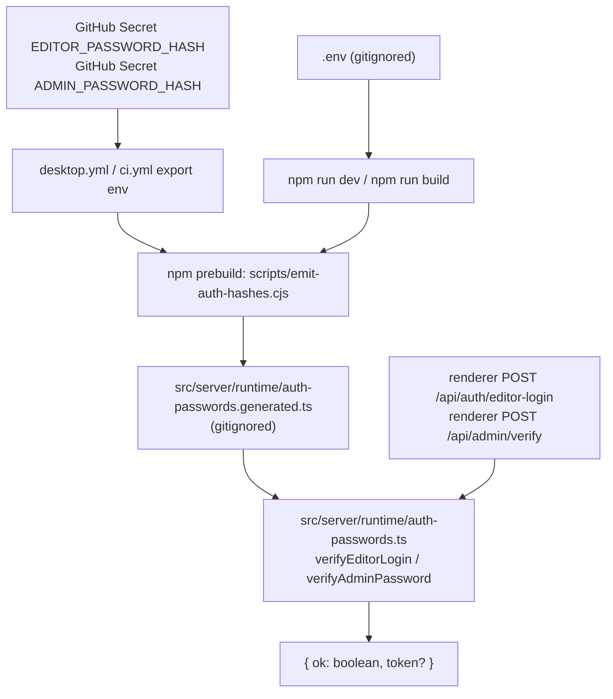

# Future Task: Auth Password Infrastructure (Shared)

> Foundation for `FUTURE_TASK_EDITOR_LOGIN_GATE.md` and
> `FUTURE_TASK_SETTINGS_TWO_TABS.md`. Implement this first.

## Goal

Add a shared, server-side password verification layer used by two
upcoming gates (editor login on app entry, admin gate inside Settings).
Two fixed passwords per build, never stored in the git repo as plaintext
or hash, verified with Argon2id in the Next server / Electron main
process.

## Research Summary

- **Don't ship plaintext or the password in the renderer bundle.** Anyone
  with `app.asar` and a text editor can read it. Verification must happen
  server-side.
- **OWASP recommends Argon2id** (memory-hard, ~19 MiB / 2 iters / 1
  parallel minimum). Resists GPU/ASIC attacks. bcrypt also fine but
  silently truncates at 72 bytes.
- **`crypto.timingSafeEqual`** for constant-time username comparison
  (Argon2 verify is already constant-time internally).
- **Electron `safeStorage`** (DPAPI on Windows, Keychain on macOS) is for
  *runtime user secrets* like the editor session token, not for
  build-time baked secrets.
- **GitHub Secrets** are masked in CI logs and never persisted to the
  repo, making them the right canonical source for production hashes.
- **No prior commits** in this repo touch app-level auth (`git log
  --grep` for settings/login/password/auth returns only pitch-deck and
  Cloudflare docs work). This is greenfield.

Useful sources:

- https://www.electronjs.org/docs/latest/api/safe-storage
- https://github.com/electron/electron/blob/main/docs/api/safe-storage.md
- https://owasp.org/www-project-cheat-sheets/cheatsheets/Password_Storage_Cheat_Sheet.html
- https://github.com/ranisalt/node-argon2
- https://docs.github.com/en/actions/security-guides/encrypted-secrets

## Proposed Behavior



## Implementation Plan

1. **Add dependency.**
   - `npm install argon2`.
   - Confirm it builds inside Electron Forge (native module — may need
     `@electron-forge/plugin-auto-unpack-natives`, already in
     `forge.config.cjs`).

2. **Create `scripts/hash-password.cjs`.**
   - Prompts for a password (no echo), prints the Argon2id hash to
     stdout.
   - Used by the maintainer once per password rotation.

3. **Create `scripts/emit-auth-hashes.cjs`.**
   - Reads `EDITOR_PASSWORD_HASH` and `ADMIN_PASSWORD_HASH` from
     `process.env`.
   - In production builds, errors if either is missing.
   - In dev/test, falls back to a banner hash and prints a warning.
   - Writes
     `src/server/runtime/auth-passwords.generated.ts` with
     `export const EDITOR_HASH = "..."; export const ADMIN_HASH = "...";`.

4. **Create `src/server/runtime/auth-passwords.ts`.**
   - Re-exports the generated constants via a thin wrapper.
   - `verifyEditorLogin(username: string, password: string): Promise<boolean>`
     - First does `crypto.timingSafeEqual` against `"v1editor"`.
     - Then `argon2.verify(EDITOR_HASH, password)`.
   - `verifyAdminPassword(password: string): Promise<boolean>`
     - `argon2.verify(ADMIN_HASH, password)`.

5. **Wire build pipeline.**
   - `package.json`: add `"prebuild": "node scripts/emit-auth-hashes.cjs"`.
   - `.gitignore`: add `src/server/runtime/auth-passwords.generated.ts`.
   - `.env.example`: document both env vars with a pointer to
     `scripts/hash-password.cjs`.

6. **Wire GitHub Secrets.**
   - In repo settings, add `EDITOR_PASSWORD_HASH` and
     `ADMIN_PASSWORD_HASH` as **Repository Secrets**.
   - `.github/workflows/desktop.yml`: pass them to `electron-forge make`
     via `env:` block.
   - `.github/workflows/ci.yml`: pass *test-only* hash secrets
     (`CI_EDITOR_PASSWORD_HASH`, `CI_ADMIN_PASSWORD_HASH`) so CI builds
     can exercise the gates without leaking the production password.

7. **Unit tests (`src/test/auth-passwords.test.ts`).**
   - `verifyEditorLogin` rejects wrong username, wrong password.
   - `verifyAdminPassword` accepts the right password, rejects wrong.
   - Both run in <500 ms with Argon2 default parameters.

## Verification

```bash
node scripts/hash-password.cjs          # emit a sample hash
EDITOR_PASSWORD_HASH=$(node scripts/hash-password.cjs <<< 'demo-editor') \
ADMIN_PASSWORD_HASH=$(node scripts/hash-password.cjs <<< 'demo-admin') \
  npm run build                         # prebuild emits the generated file
npx tsc --noEmit
npm test -- src/test/auth-passwords.test.ts
```

Manual:

- Grep the built bundle for the plaintext password — must not appear.
- Grep the source tree for either hash — must not appear (only in the
  gitignored generated file).
- Run the editor and admin verify functions with right/wrong values from
  a Node REPL against the generated file.

## Non-Goals

- No user accounts, signup, or password recovery.
- No remote auth provider (no OAuth, no SSO).
- No password-strength UI — the password is fixed per build by the
  maintainer.
- No protection against an attacker with local code execution: a
  determined attacker can patch the bundle. This is UI gating, not crypto
  separation.
