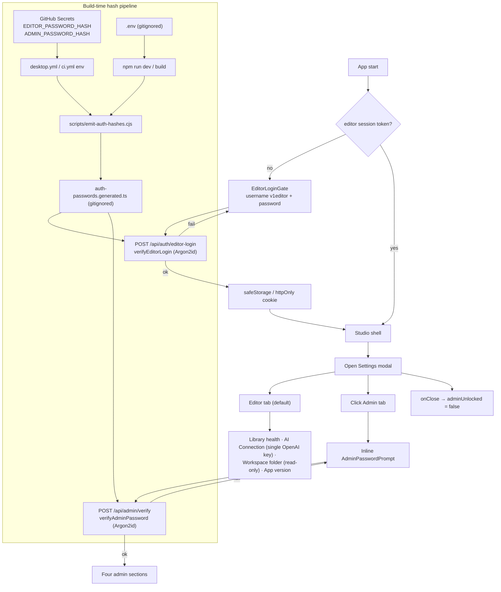

# Future Task: Editor & Admin Gates (Login + Settings Redesign)

## Goal

Make the app safe for a non-technical broadcast editor. Two role-based
gates land together in one task:

1. **Editor login** at app entry — username `v1editor` + password — so the
   Studio only opens for a recognised editor.
2. **Settings modal redesign** — collapse the current five tabs into two:
   - **Editor (עורך)** — calm, mostly read-only. The only writable
     control is a single OpenAI API key.
   - **Admin (ניהול 🔒)** — password-gated. Re-locks every time the modal
     closes. Holds all the technical panels (catalog diagnostic,
     workspace + FFmpeg paths, all three AI keys + provider radio, R2
     cloud, clear cache, uninstall).

Both gates share one fixed-per-build password mechanism (Argon2id), with
hashes flowing from GitHub Secrets at build time. No plaintext or hash is
committed to the repo.

## Research Summary

### Current state (greenfield — no prior commits)

- Settings modal: `src/client/components/studio/SettingsModal.tsx`
  (1–673), five tabs in desktop mode:
  - Overview — `SettingsOverviewPanel.tsx` (1–107) — read-only dashboard.
  - Catalog — `SettingsCatalogPanel.tsx` (1–113) — refresh + missing IDs.
  - Desktop — `SettingsDesktopPanel.tsx` (1–236) — workspace, FFmpeg
    paths, clear cache, uninstall.
  - AI — `SettingsAiPanel.tsx` (1–110) — three `SecretField`s + provider
    radio.
  - Cloud — `SettingsCloudPanel.tsx` (1–256) — R2 credentials + sync.
- Opened from `Masthead.tsx:42–68`. No shared `useSettings` hook; state
  is local to the modal.
- App entry has **no login today**. The only gate is
  `StorageOnboardingGate.tsx` (1–301), which collects R2 Basic-Auth
  credentials — not an identity check. It stays untouched and runs
  *after* the new editor login.
- Desktop perimeter: `src/proxy.ts` enforces `x-weather-desktop-token` on
  `/api/*` for Electron. Web mode short-circuits — no auth at all
  currently.
- `git log --all --grep` for settings/login/password/auth shows nothing.
  Fully greenfield.

### Password storage best practices (web research)

- **Don't ship plaintext or the password in the renderer bundle.** Anyone
  with `app.asar` and a text editor can read it. Verification must
  happen server-side.
- **OWASP recommends Argon2id** (memory-hard, ~19 MiB / 2 iters / 1
  parallel minimum). Resists GPU/ASIC attacks. bcrypt also fine but
  silently truncates at 72 bytes.
- **`crypto.timingSafeEqual`** for constant-time username comparison
  (Argon2 verify is already constant-time internally).
- **Electron `safeStorage`** (DPAPI on Windows, Keychain on macOS) is for
  *runtime user secrets* like the editor session token — not for
  build-time baked secrets.
- **GitHub Secrets** are masked in CI logs and never persisted to the
  repo, making them the right canonical source for production hashes.

Useful sources:

- https://www.electronjs.org/docs/latest/api/safe-storage
- https://owasp.org/www-project-cheat-sheets/cheatsheets/Password_Storage_Cheat_Sheet.html
- https://github.com/ranisalt/node-argon2
- https://docs.github.com/en/actions/security-guides/encrypted-secrets

## Proposed Behavior



## Implementation Plan

### Phase 1 — Shared password infrastructure

1. **Add dependency.** `npm install argon2`. Confirm it builds inside
   Electron Forge (native module — `@electron-forge/plugin-auto-unpack-natives`
   is already in `forge.config.cjs`).
2. **`scripts/hash-password.cjs`** — prompts for a password (no echo),
   prints the Argon2id hash to stdout. Used once per password rotation
   by the maintainer.
3. **`scripts/emit-auth-hashes.cjs`** — reads `EDITOR_PASSWORD_HASH` and
   `ADMIN_PASSWORD_HASH` from `process.env`; in production builds errors
   if either is missing; in dev/test falls back to a banner hash with a
   warning. Writes `src/server/runtime/auth-passwords.generated.ts` with
   `export const EDITOR_HASH = "..."; export const ADMIN_HASH = "...";`.
4. **`src/server/runtime/auth-passwords.ts`** — wraps the generated file.
   - `verifyEditorLogin(username, password)` — `crypto.timingSafeEqual`
     against `"v1editor"`, then `argon2.verify(EDITOR_HASH, password)`.
   - `verifyAdminPassword(password)` — `argon2.verify(ADMIN_HASH, password)`.
5. **Wire build pipeline.**
   - `package.json`: add `"prebuild": "node scripts/emit-auth-hashes.cjs"`.
   - `.gitignore`: add `src/server/runtime/auth-passwords.generated.ts`.
   - `.env.example`: document both env vars and point to
     `scripts/hash-password.cjs`.
6. **GitHub Secrets.**
   - Repo settings → add `EDITOR_PASSWORD_HASH` and `ADMIN_PASSWORD_HASH`
     as Repository Secrets.
   - `.github/workflows/desktop.yml`: pass them to `electron-forge make`
     via `env:`.
   - `.github/workflows/ci.yml`: pass *test-only* hash secrets
     (`CI_EDITOR_PASSWORD_HASH`, `CI_ADMIN_PASSWORD_HASH`) so CI can
     exercise the gates without leaking production.

### Phase 2 — Editor login (app entry)

7. **`src/app/api/auth/editor-login/route.ts`** — POST `{ username, password }`
   → `verifyEditorLogin`. On success generates a 32-byte random token,
   stores it in an in-memory `Set` keyed by process, returns `{ ok, token }`
   and sets an `httpOnly`/`sameSite: lax`/`secure` (web) cookie
   `weather_editor_session`.
8. **`src/app/api/auth/sign-out/route.ts`** — POST → revokes the token,
   clears the cookie.
9. **`src/server/runtime/editor-session.ts`** — `issueToken()`,
   `isValidToken(token)`, `revokeToken(token)`.
10. **`src/proxy.ts`** — in web mode require the cookie on `/api/*`
    except `/api/auth/editor-login`. In desktop mode the existing
    desktop-token check stays; the editor cookie becomes an *additional*
    required check so the renderer can't skip login.
11. **Desktop session persistence (IPC).** `electron/main.cjs` — three
    new handlers: `desktop:setEditorSession({ token })` (safeStorage +
    inject into child env), `desktop:getEditorSession`,
    `desktop:clearEditorSession`. `electron/preload.cjs` exposes one
    wrapper per channel via `contextBridge` — never expose
    `ipcRenderer`.
12. **`src/client/components/auth/EditorLoginGate.tsx`** — full-screen
    RTL card mirroring `StorageOnboardingGate.tsx`'s visual language.
    Username field pre-filled and locked to `v1editor`; password field
    with show/hide; Sign in button. On success, store token, render
    `props.children`.
13. **`src/app/page.tsx`** — wrap the Studio shell in `EditorLoginGate`.
    On mount check the session (desktop: IPC; web: probe a small
    `/api/auth/me` route). Render gate or Studio accordingly.
14. **`src/client/components/Masthead.tsx`** — add a "Sign out" entry
    that POSTs `/api/auth/sign-out`, clears the desktop session, and
    reloads.

### Phase 3 — Settings modal redesign (two tabs)

15. **`src/app/api/admin/verify/route.ts`** — POST `{ password }` →
    `verifyAdminPassword`. Returns `{ ok: boolean }`. No token issued —
    gating is per-modal-open, not per-session. Sits behind the editor
    session check.
16. **`src/client/components/studio/settings/EditorTabPanel.tsx`** (new):
    - **Library card** — reuse `useCatalogHealth` data; render one
      friendly line (`Library health: ✓ 124 clips ready` / yellow / red).
      No refresh button, no missing IDs list.
    - **AI Connection card** — reuse the existing `SecretField` for
      *only* `OPENAI_API_KEY`. Label: "OpenAI key (for voice
      transcription)". Status chip green/red. No Anthropic, no Gemini,
      no provider radio.
    - **Workspace card** — read-only path + `Change in Admin →` button
      that switches the active tab to Admin.
    - **App card** — version + "Check for updates" button (reuses
      `desktop.getUpdateState()`).
17. **`src/client/components/studio/settings/AdminTabPanel.tsx`** (new):
    - Internal state `adminUnlocked: boolean`, default false.
    - If locked, render inline `AdminPasswordPrompt` (centered card,
      password field, Unlock button, error on wrong).
    - On successful POST, set `adminUnlocked = true` and render the four
      existing panel components in this order with section headers:
      1. **קטלוג** → `SettingsCatalogPanel`
      2. **דסקטופ וקבצים** → `SettingsDesktopPanel`
      3. **AI ומודלים** → `SettingsAiPanel`
      4. **ענן (R2)** → `SettingsCloudPanel`
    - Small "Lock now" button at the top once unlocked.
18. **`SettingsModal.tsx`** — replace the 5-tab layout with two tabs
    (`editor` default, `admin`). Hold `adminUnlocked` at modal level so
    it resets to `false` in `onClose` (per user choice). Delete
    `SettingsOverviewPanel.tsx` (subsumed by Editor tab). Keep the four
    other panel files intact — they're reused inside the Admin tab
    unchanged.

### Phase 4 — Tests + verification

19. **Unit tests.**
    - `src/test/auth-passwords.test.ts` — `verifyEditorLogin` rejects
      wrong username, wrong password; accepts both right.
      `verifyAdminPassword` accepts right, rejects wrong.
    - `src/test/editor-session.test.ts` — token issue/validate/revoke
      round-trip.
20. **Component tests.**
    - `src/test/editor-login.test.tsx` — gate renders without session,
      right password reveals children, wrong password shows error.
    - `src/test/settings-modal.test.tsx` — Editor tab renders without
      unlock; Admin tab shows prompt; right password reveals four
      sections; close + reopen re-locks Admin.
21. **API route tests.**
    - `src/test/admin-verify-route.test.ts` — right → `{ ok: true }`,
      wrong → `{ ok: false }` (avoid 4xx to not leak enumeration via
      status code).

## Verification

```bash
# Generate hashes (one-time per password rotation)
node scripts/hash-password.cjs            # paste output into .env

# Standard verification stack
npx tsc --noEmit
npm test
npm run build                              # prebuild emits the gitignored hash file
npm run electron:dev                       # exercise both gates end-to-end
```

Manual checks:

- **Build hygiene** — grep the built bundle for the plaintext password
  (must not appear) and grep the source tree for either hash (must only
  appear in the gitignored generated file).
- **Editor login** — cold start with no safeStorage entry → gate
  appears; right password lets in; reload keeps you in; quit + relaunch
  keeps you in (safeStorage); sign out returns to gate.
- **Settings Editor tab** — friendly cards, OpenAI key entry persists
  via existing `desktop:saveSettings` IPC, "Change in Admin →" switches
  tabs.
- **Settings Admin tab** — wrong password rejected, right password
  reveals the four sections in order; close + reopen modal re-locks.
- **Web mode (`npm run dev`)** — same flow via cookie.

## Critical files

| Path | Action |
| --- | --- |
| `src/server/runtime/auth-passwords.ts` | new — verify functions |
| `src/server/runtime/auth-passwords.generated.ts` | new, gitignored |
| `src/server/runtime/editor-session.ts` | new — token store |
| `scripts/hash-password.cjs` | new — maintainer CLI |
| `scripts/emit-auth-hashes.cjs` | new — build-time emit |
| `src/app/api/auth/editor-login/route.ts` | new |
| `src/app/api/auth/sign-out/route.ts` | new |
| `src/app/api/admin/verify/route.ts` | new |
| `src/client/components/auth/EditorLoginGate.tsx` | new |
| `src/client/components/studio/settings/EditorTabPanel.tsx` | new |
| `src/client/components/studio/settings/AdminTabPanel.tsx` | new |
| `src/client/components/studio/SettingsModal.tsx` | replace tabs |
| `src/client/components/studio/settings/SettingsOverviewPanel.tsx` | delete |
| `src/app/page.tsx` | wrap in `EditorLoginGate` |
| `src/client/components/Masthead.tsx` | add sign-out |
| `src/proxy.ts` | enforce editor session in web mode |
| `electron/main.cjs` | three new session IPC handlers |
| `electron/preload.cjs` | expose three session wrappers |
| `.env.example` | document new env vars |
| `.gitignore` | add generated hash file |
| `package.json` | add `argon2`, `prebuild` script |
| `.github/workflows/desktop.yml` | wire prod secrets |
| `.github/workflows/ci.yml` | wire CI-only test secrets |

## Reused functions / patterns

- `safeStorage` encrypt/decrypt helpers — `electron/config.cjs:144`.
- `SecretField` component inside the existing AI panel — reused on the
  Editor tab.
- `useCatalogHealth` hook (in `SettingsCatalogPanel.tsx`) — drives the
  Editor tab's friendly summary.
- `StorageOnboardingGate.tsx`'s RTL visual language — mirrored for
  `EditorLoginGate.tsx`.
- IPC handler shape from `electron/main.cjs:357` (`saveSettings`) —
  copied for the three new session-token channels.

## Non-Goals

- No user accounts, signup, password recovery, or password-strength UI —
  passwords are fixed per build by the maintainer.
- No remote auth provider (OAuth/SSO).
- No idle auto-lock of the Studio.
- No per-tab keyboard shortcut beyond the existing Escape close.
- No fine-grained permission system — single editor identity, single
  admin password.
- No audit log of admin unlocks.
- Not moving R2 onboarding (`StorageOnboardingGate`) into the new tabs —
  it stays as a first-run flow that runs after the editor login.
- No protection against an attacker with local code execution: a
  determined attacker can patch the bundle. This is UI gating, not crypto
  separation.
