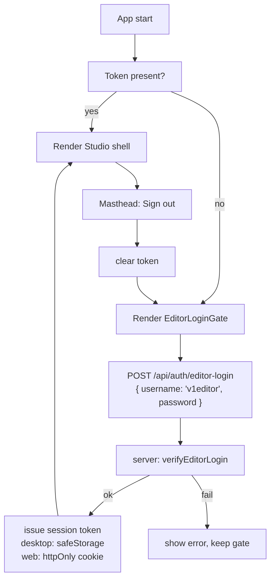

# Future Task: Editor Login Gate (App Entry)

> **Depends on** `FUTURE_TASK_AUTH_PASSWORD_INFRA.md`. Land that first.

## Goal

Require the broadcast editor to sign in as username `v1editor` with the
fixed editor password before reaching the Studio. Session persists
across reloads (so daily use isn't disruptive) but clears on quit / sign
out.

The existing `StorageOnboardingGate.tsx` is the **R2 cloud credentials
gate**, not an identity check — leave it untouched. The new gate runs
*before* it.

## Research Summary

- Today's app boots straight into `src/app/page.tsx` (the Studio shell).
  There's no app-entry login.
- The only existing gate is
  `src/client/components/storage/StorageOnboardingGate.tsx` (lines
  33–301), which collects R2 Basic-Auth credentials and saves them via
  IPC `desktop:saveSettings` → `safeStorage`.
- Desktop perimeter: `src/proxy.ts` enforces a per-launch
  `x-weather-desktop-token` on `/api/*` for Electron. In web mode the
  middleware short-circuits — currently there's no auth at all in web
  mode.
- Session-token pattern already used in the repo: opaque 32-byte random,
  stored in `safeStorage` for desktop and `httpOnly` cookie for web.
- `git log --grep` shows no prior login work; greenfield.

## Proposed Behavior



## Implementation Plan

1. **Server: session token issuance.**
   - New route `src/app/api/auth/editor-login/route.ts`:
     - POST `{ username, password }` → calls `verifyEditorLogin` from the
       infra task.
     - On success: generates `crypto.randomBytes(32).toString('hex')`,
       stores it in an in-memory `Set<string>` keyed by process (cleared
       on restart).
     - Returns `{ ok: true, token }` plus sets an `httpOnly`,
       `sameSite: 'lax'`, `secure` (web) cookie `weather_editor_session`.
   - New route `src/app/api/auth/sign-out/route.ts`:
     - POST → revokes the token (removes from the in-memory set), clears
       the cookie.
   - New helper `src/server/runtime/editor-session.ts`:
     - `issueToken()`, `isValidToken(token)`, `revokeToken(token)`.

2. **Perimeter enforcement.**
   - `src/proxy.ts`:
     - In **web** mode, require the cookie on every `/api/*` route
       except `/api/auth/editor-login` and `/api/health` (if any).
     - In **desktop** mode, the existing
       `x-weather-desktop-token` check stays. Add the editor session
       cookie as an *additional* required check so a renderer can't skip
       login by replaying a desktop token.

3. **Desktop session persistence (IPC).**
   - `electron/main.cjs`: add IPC handlers
     - `desktop:setEditorSession({ token })` → encrypted into
       `settings.session.editorToken` via `safeStorage`, also injected
       into the Next child's env on next spawn (so the child accepts the
       cookie on first request).
     - `desktop:getEditorSession()` → returns decrypted token or null.
     - `desktop:clearEditorSession()` → erases it.
   - `electron/preload.cjs`: expose `window.desktop.setEditorSession`,
     `getEditorSession`, `clearEditorSession` (one wrapper per channel,
     never expose `ipcRenderer` itself).

4. **Renderer: gate component.**
   - New file
     `src/client/components/auth/EditorLoginGate.tsx`:
     - Full-screen RTL card, visual language mirrors
       `StorageOnboardingGate.tsx`.
     - Username field, pre-filled with `v1editor`, locked (read-only).
     - Password field, masked, show/hide toggle.
     - "Sign in" button → POST to `/api/auth/editor-login`.
     - On success: in desktop mode call `desktop.setEditorSession`, in
       web mode the cookie is set automatically. Then render
       `props.children`.
     - On failure: show "Wrong password" message, leave field for retry.

5. **Wire into the app shell.**
   - `src/app/page.tsx`:
     - On mount, check for an existing session
       (desktop: `desktop.getEditorSession()`, web: probe a
       `/api/auth/me` route that just returns `{ ok }` based on cookie).
     - If no session, render `<EditorLoginGate>`; otherwise render the
       existing Studio shell.
   - `src/client/components/Masthead.tsx`: add a "Sign out" entry
     (under the Settings button or a small user menu). On click: POST
     `/api/auth/sign-out`, clear desktop session, reload to gate.

6. **Tests.**
   - `src/test/editor-login.test.tsx`:
     - Gate renders when no session.
     - Submitting right password swaps to children.
     - Submitting wrong password shows error.
   - `src/test/editor-session.test.ts`:
     - `issueToken` / `isValidToken` / `revokeToken` round-trip.

## Verification

```bash
npx tsc --noEmit
npm test
npm run build
npm run electron:dev   # confirm IPC session storage works end-to-end
```

Manual:

- Cold start (no `safeStorage` entry): gate appears, accepts the right
  password, lets you in.
- Reload page: stays in.
- Quit and relaunch: session persists (safeStorage survives) — sign in
  not required again unless user explicitly signed out.
- Sign out from Masthead: returns to gate.
- Web mode (`npm run dev`): same flow via cookie.

## Non-Goals

- No multiple user accounts.
- No remember-me toggle (persistence is on by default).
- No rate limiting on the login endpoint — local app, low value target.
  Add only if abuse is observed.
- No idle auto-lock of the Studio (separate future task if requested).
