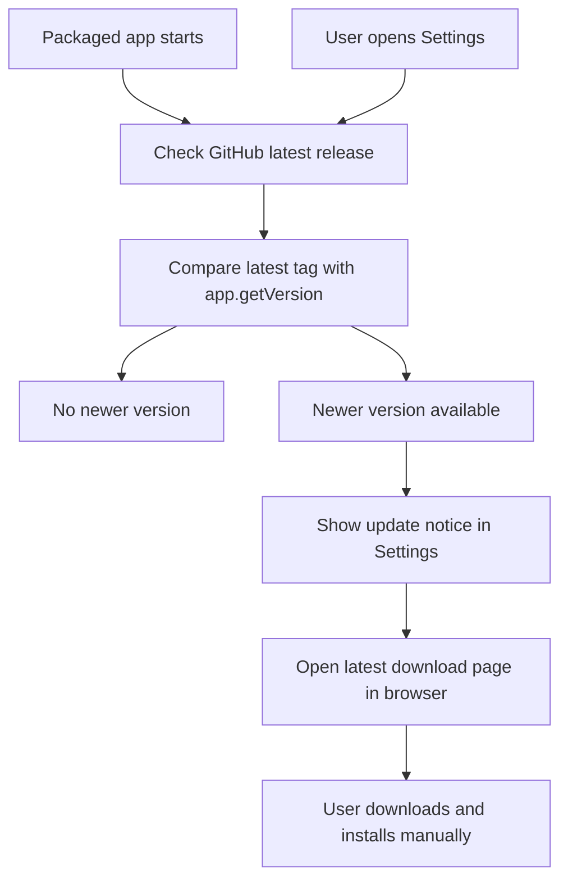

# Future Task: Manual Desktop Update Check

## Goal

Replace the current auto-update direction with a lightweight manual-update flow:

- Do not require signed macOS or Windows builds.
- Do not require Squirrel-compatible update feeds.
- Keep publishing GitHub Release installer assets as today.
- Let the installed app detect when a newer GitHub Release exists.
- Guide the user to download and install the newest build manually.

This is not silent auto-update. It is "update available" detection plus a safe download path.

## Research Summary

Electron's official auto-update stack is built around `autoUpdater` and Squirrel-compatible update metadata.

- `update-electron-app` checks at startup and every 10 minutes by default.
- When an update is found, it downloads in the background and prompts the user to restart.
- The public `update.electronjs.org` path expects GitHub Releases and code-signed macOS builds.
- Static update storage still expects platform metadata such as macOS `RELEASES.json` and Windows `RELEASES`.
- Windows Squirrel updates require generated `.nupkg`/`RELEASES` assets, not just the setup `.exe`.

Because the desired direction is unsigned builds and no Squirrel feed, the app should not use `autoUpdater` for production behavior.

Useful sources:

- https://github.com/electron/update-electron-app
- https://www.electronjs.org/docs/latest/tutorial/updates
- https://docs.github.com/en/rest/releases/releases#get-the-latest-release

## Proposed Behavior



## Implementation Plan

1. Remove production dependency on `update-electron-app`.
   - In `electron/main.cjs`, replace `wireAutoUpdater()` with a manual release checker.
   - Keep dev behavior as `unavailable`, but make the reason explicit: manual checks only run in packaged builds.
   - Stop listening to `autoUpdater` events, because no feed or self-install flow will be used.

2. Add a manual GitHub release check in Electron main.
   - Fetch `https://api.github.com/repos/barmoshe/weatherv1-next/releases/latest`.
   - Parse `tag_name`, `html_url`, and release assets.
   - Compare the latest semver tag, such as `v0.1.10`, against `app.getVersion()`.
   - Treat draft/prerelease releases as out of scope, matching GitHub's latest-release endpoint behavior.

3. Extend the desktop bridge update state.
   - Update `src/shared/desktop.ts` so `DesktopUpdateState` can represent:
     - `manual-unavailable`
     - `checking`
     - `idle`
     - `available`
     - `error`
   - Include fields such as `currentVersion`, `latestVersion`, `releaseUrl`, and optional `downloadUrl`.

4. Add a user action to open the update.
   - Add an IPC handler in `electron/main.cjs`, for example `desktop:openLatestRelease`.
   - Use `shell.openExternal()` to open either:
     - the latest release page, or
     - the platform-specific asset URL when available.
   - Prefer the existing stable links:
     - `https://github.com/barmoshe/weatherv1-next/releases/latest/download/WeatherV1-macOS.zip`
     - `https://github.com/barmoshe/weatherv1-next/releases/latest/download/WeatherV1-Setup.exe`

5. Update Settings UI copy.
   - In `src/client/components/studio/SettingsModal.tsx`, show a clear manual-update status.
   - If a newer version exists, show current version, latest version, and a button that opens the download page.
   - If the check fails, show a non-blocking message and keep the app usable.

6. Update docs to remove the old auto-update promise.
   - Update `docs/ELECTRON_DESKTOP_PLAN.md`.
   - Update `docs/ELECTRON_DESKTOP_HANDOFF.md`.
   - Update `docs/RELEASE_CONVENTION.md` if release verification should include "manual update check sees latest".
   - Keep the release asset convention unchanged.

7. Optional cleanup after the manual flow lands.
   - Remove `update-electron-app` from `package.json` and `package-lock.json`.
   - Consider whether `electron-squirrel-startup` is still needed if Windows packaging continues to use Squirrel only as an installer.

## Verification

Run:

```bash
npx tsc --noEmit
npm test
npm run build
npm run electron:build
```

Manual checks:

- In a packaged build with the same version as latest, Settings says no update is available.
- In an older packaged build, Settings shows the newer release and opens the correct GitHub download URL.
- If GitHub is offline or rate-limited, Settings shows a non-blocking error.
- New releases still publish `WeatherV1-macOS.zip` and `WeatherV1-Setup.exe`.

## Non-Goals

- No silent background download.
- No automatic install on restart.
- No Squirrel update feed.
- No code-signing requirement for this update notification flow.
- No staged rollout or delta-update support.
