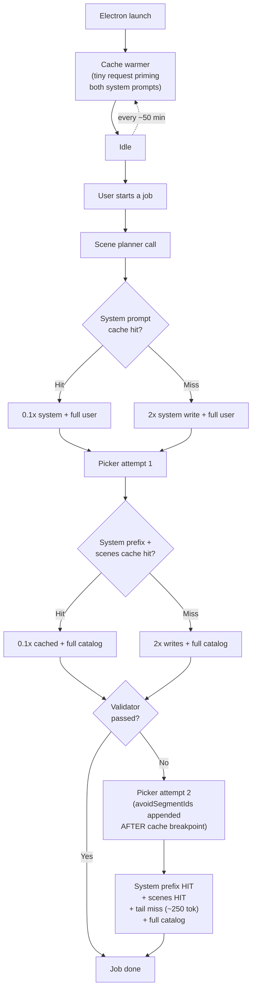

# Future Task: Minimize AI Input Tokens (Scene Planner + Picker)

## Goal

Cut input-token spend on the two LLM call sites in the desktop app — the **scene planner** (`src/server/pipeline/scene-planner.ts`) and the **clip picker** (`src/server/pipeline/picker.ts`) — **without changing model outputs**.

Hard constraint from the requester:

- **Bit-identical outputs.** The model must see the same content in the same role; only cache metadata and breakpoint placement may change. No prompt rewording, no JSON→TSV swap, no field dropping, no pre-filtering of the catalog, no shuffle changes.
- **Keep the full catalog.** Sending every catalog row to the picker is a design value, not an accident.
- **Ship safe levers only.** No eval harness is in scope.

Out-of-scope optimizations are documented in [Non-Goals](#non-goals) so they're not relitigated.

## Research Summary

### Current LLM surface (full inventory)

The Electron app has exactly two LLM call sites. There is no vision/tagging/beat-tagging LLM use; the validator is rule-based; Whisper is audio-bytes-in, not relevant here.

| Call | Model | System | User payload | Caching today | Frequency |
| --- | --- | --- | --- | --- | --- |
| Scene planner (`scene-planner.ts:346`) | `claude-sonnet-4-6` / `gpt-4o` | `DEFAULT_SCENE_PROMPT` ~6,000 tok | transcript + Whisper segments, ~500–1,500 tok | Anthropic ephemeral on system **only when no custom prompt** (`scene-planner.ts:356`) | 1× per job |
| Picker (`picker.ts:445`) | same | `SCENE_AWARE_SYSTEM_PROMPT` ~8,500 tok (+ `PICKER_FALLBACK_PROMPT` ~250 tok on retry) | scenes + full catalog (~100–500 rows) + optional retry feedback, ~1,500–5,000 tok | Anthropic ephemeral on system, **only when** `!customPrompt && !avoidSegmentIds.size && attempt === 1 && !retryFeedback` (`picker.ts:441–442`) | 1–3× per job |

### Current cache foot-guns

1. **`avoidSegmentIds` is appended to the picker system prompt** (`picker.ts:418–419`). Any retry mutates the cached prefix and kills the cache for attempts 2–3.
2. **`PICKER_FALLBACK_PROMPT` is appended to the system prompt** on retry (per the picker call-site analysis). Same effect — invalidates the prefix.
3. **No cache breakpoint inside the user payload.** The `scenes` block is stable across a job's retries but is currently re-billed at full rate every attempt.
4. **Default TTL dropped from 60 min → 5 min in March 2026.** Cross-job cache rarely survives a normal editing pause.
5. **No cache warming.** The first real job after launch always pays the full write cost.

### Anthropic prompt caching, 2026 state

| Knob | Value |
| --- | --- |
| Cache types | `ephemeral` only |
| TTL options | 5 min (default) or 1 h (`cache_control: { type: "ephemeral", ttl: "1h" }`) |
| Pricing | Write 5 min = 1.25× base · Write 1 h = 2× base · Read = 0.1× base |
| 1 h break-even | After **4 cache reads** per write |
| Isolation | Per-workspace since Feb 2026 |
| Persistent / files-based cache | **Does not exist.** Long-lived context must be re-written hourly. |

Sources:

- https://platform.claude.com/docs/en/build-with-claude/prompt-caching
- https://dev.to/whoffagents/anthropic-silently-dropped-prompt-cache-ttl-from-1-hour-to-5-minutes-16ao
- https://dev.to/whoffagents/claude-prompt-caching-in-2026-the-5-minute-ttl-change-thats-costing-you-money-4363
- https://redis.io/blog/llm-token-optimization-speed-up-apps/
- https://www.anthropic.com/engineering/advanced-tool-use

### Expected savings under the bit-identical constraint

Worked example — 4 jobs in one hour, each with 1 planner call + 3 picker attempts:

| | Today | After this task | Δ |
| --- | --- | --- | --- |
| Per-hour input | ~168,000 tok | ~57,000 tok | **−66%** |
| Single-job session (no cross-job hits) | ~42,000 tok | ~32–34,000 tok | **−20–25%** |

The single-job number is the floor — driven by relocating cache breakpoints so retry attempts within one job stop paying full price. The hourly number is the ceiling, gated on the 1 h TTL paying off after ≥4 cache reads.

The remaining ~3 k/attempt catalog payload cannot be cached under the bit-identical constraint, because `shuffleCatalogRows` (`picker.ts:382, 521, 537`) re-orders the rows on every attempt. See [Non-Goals](#non-goals).

## Proposed Behavior



Key invariants the design must preserve:

- The model sees the same bytes in the same roles as today. Only `cache_control` marker positions and `ttl` fields change.
- `shuffleCatalogRows` keeps its current per-attempt behavior. The catalog block is **never** cached.
- No system-prompt mutation across retries above the cache breakpoint. Any per-retry content (`avoidSegmentIds`, `PICKER_FALLBACK_PROMPT`, `retryFeedback`) must sit at the tail, below the breakpoint, or in the user message.

## Implementation Plan

**Deferred — to be filled in when the task is picked up.**

Locked-in scope (do not relitigate when planning):

- Add `ttl: "1h"` to the scene-planner system `cache_control`.
- Add `ttl: "1h"` to the picker system `cache_control`.
- Move the picker system-prompt cache breakpoint to **before** `avoidSegmentIds` is appended (`picker.ts:418–419`). Bytes unchanged; only marker position moves.
- Audit and relocate `PICKER_FALLBACK_PROMPT` (and anything else that mutates the system prompt across attempts) so the cached prefix is stable.
- Add a second `cache_control` breakpoint in the picker user payload **after** the `scenes` block and **before** the catalog (`picker.ts:422–430`).
- Audit both cached prefixes for accidental cache-busters: timestamps, job IDs, UUIDs, environment-dependent strings.
- Add a cache warmer in `electron/main.cjs` lifecycle: one tiny prompt-priming request at app launch + a refresh every ~50 min while idle, so the 1 h cache stays hot through editor pauses.

Out of locked-in scope:

- Whether to also enable the same plumbing for the OpenAI provider (`gpt-4o` ignores Anthropic cache hints; revisit if any prompt-cache-eligible OpenAI model is adopted).
- Whether to surface cache hit/miss telemetry in `src/server/billing/` to validate the savings post-ship.

## Verification

Run:

```bash
npx tsc --noEmit
npm test
```

Behavior checks (the point is to prove nothing drifted):

- Capture the exact request body sent to Anthropic for a representative job before and after the change. Diff them. Only `cache_control` block placement and `ttl` fields should differ. Roles, content order, and content bytes must match.
- Run the same recording through `npm run electron:dev` before and after. Confirm scene boundaries, picks, and `picker_reason` strings are identical.
- Inspect Anthropic usage response headers / API logs for two consecutive picker attempts in one job. Attempt 2 should show a large `cache_read_input_tokens` and only the tail (`avoidSegmentIds` + `retryFeedback`) as `input_tokens`.
- Run four jobs within one hour. Confirm scene-planner and picker system prompts report cache reads on jobs 2–4.
- Idle the app for >5 min, then run a job. With the warmer in place, the system prompt should still hit cache. Without the warmer (toggle off), it should miss.

## Non-Goals

The following were considered and **explicitly rejected** under the bit-identical-outputs + keep-full-catalog constraints. Do not reopen as part of this task; spin them out separately if revisited later.

- **Catalog content caching.** Blocked by `shuffleCatalogRows` running per attempt. Would require either per-job shuffle (small drift on retry attempts) or deterministic shuffle (larger drift, but unlocks cross-job catalog caching). Both change model outputs and violate the constraint.
- **JSON → TSV/TOON catalog format.** Would cut catalog payload ~40–50% per the Redis 2026 analysis, but the model reads compact formats with subtly different attention. Off-limits without an eval.
- **Pre-filtering catalog rows per scene** (top-K by tag overlap / embedding similarity). Largest single token win available, but contradicts the "keep full catalog" design value.
- **Prompt verbosity edits** (collapsing the 4× repeated "weather state outranks geography" in the picker system prompt; merging rules B + B2; trimming the duplicated "scene boundaries / heterogeneous" guidance in the scene-planner prompt). Estimated ~25% system-prompt reduction, but rewording can shift the model's attention even when semantically equivalent.
- **Dropping fields the model may ignore** (e.g., `source`, `orientation`, `concepts.avoid_for`). Cannot be confirmed safe without measurement; no eval harness in scope.
- **Tool-Search-Tool-style on-demand catalog surfacing.** Architectural shift, not in scope.
- **Cross-provider parity.** OpenAI does not expose comparable cache controls for `gpt-4o`. The plan optimizes the Anthropic path only.
- **Eval harness / golden-job diff tooling.** Explicitly out of scope per requester. Verification relies on raw request diffing + manual side-by-side runs.
