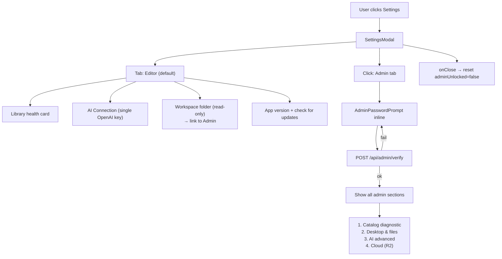

# Future Task: Settings — Two-Tab Redesign (Editor / Admin)

> **Depends on** `FUTURE_TASK_AUTH_PASSWORD_INFRA.md`. The Admin gate
> uses the shared `verifyAdminPassword` from that task.
> Best landed alongside `FUTURE_TASK_EDITOR_LOGIN_GATE.md` so both
> gates ship together, but technically independent of it.

## Goal

Collapse the current 5-tab Settings modal into **two tabs** with clear
role separation:

- **Editor (עורך)** — friendly, mostly read-only summary. One AI key
  field (OpenAI for transcription) is the only writable control. Aimed at
  the non-technical broadcast editor.
- **Admin (ניהול 🔒)** — password-gated. Holds everything technical:
  catalog diagnostic, workspace + FFmpeg paths, all three AI keys with
  provider radio, Cloud (R2), clear-cache, uninstall.

Admin re-prompts every time the modal is reopened.

## Research Summary

- Current modal: `src/client/components/studio/SettingsModal.tsx` (lines
  1–673), with five tabs in desktop mode:
  - Overview (`SettingsOverviewPanel.tsx`, 1–107) — read-only dashboard.
  - Catalog (`SettingsCatalogPanel.tsx`, 1–113) — refresh + missing IDs.
  - Desktop (`SettingsDesktopPanel.tsx`, 1–236) — workspace, FFmpeg
    paths, clear cache, uninstall.
  - AI (`SettingsAiPanel.tsx`, 1–110) — three `SecretField`s + provider
    radio.
  - Cloud (`SettingsCloudPanel.tsx`, 1–256) — R2 credentials + sync.
- Opened from `Masthead.tsx:42–68`. State all lives inside the modal
  component (no shared `useSettings` hook).
- No existing gating, no role concept.
- `git log --grep` shows no prior settings redesign — greenfield.

## Proposed Behavior



## Implementation Plan

1. **Server route for admin verify.**
   - New `src/app/api/admin/verify/route.ts`:
     - POST `{ password }` → calls `verifyAdminPassword` from
       `FUTURE_TASK_AUTH_PASSWORD_INFRA.md`.
     - Returns `{ ok: boolean }`. No token issued — gating is per-modal,
       not per-session.
     - Behind the editor session check applied by `src/proxy.ts`.

2. **New Editor tab panel.**
   - New `src/client/components/studio/settings/EditorTabPanel.tsx`:
     - **Library card**: reuse the `useCatalogHealth` data from
       `SettingsCatalogPanel.tsx`; render a single friendly line
       (`Library health: ✓ 124 clips ready` / yellow / red). No
       refresh button, no missing IDs list.
     - **AI Connection card**: reuse the existing `SecretField`
       component (currently inside `SettingsAiPanel.tsx`) for *only*
       `OPENAI_API_KEY`. Label: "OpenAI key (for voice transcription)".
       Status chip: `Connected ✓` or `Not connected`. No Anthropic, no
       Gemini, no provider radio.
     - **Workspace card**: display read-only path, plus a small
       `Change in Admin →` button that switches the active tab to Admin
       (which then shows the password prompt).
     - **App card**: version + "Check for updates" button. Reuses
       `desktop.getUpdateState()` / the manual-update plumbing from
       `FUTURE_TASK_MANUAL_UPDATE_CHECK.md` when it lands.

3. **New Admin tab panel.**
   - New `src/client/components/studio/settings/AdminTabPanel.tsx`:
     - Internal React state `adminUnlocked: boolean`, default false.
     - If locked, render an inline `AdminPasswordPrompt` (centered card,
       password field, Unlock button, show error on wrong password).
     - On successful POST to `/api/admin/verify`, set
       `adminUnlocked = true`.
     - If unlocked, render the four existing panel components in a
       vertical stack with section headers:
       1. **קטלוג** → `SettingsCatalogPanel`
       2. **דסקטופ וקבצים** → `SettingsDesktopPanel`
       3. **AI ומודלים** → `SettingsAiPanel`
       4. **ענן (R2)** → `SettingsCloudPanel`
     - Add a small "Lock now" button at the top once unlocked.

4. **Modal restructure.**
   - `SettingsModal.tsx`:
     - Replace the 5-tab structure with two tabs: `editor` (default) and
       `admin`.
     - Hold `adminUnlocked` state at the modal level so it can be reset
       in `onClose`.
     - Reset `adminUnlocked = false` on every close (per user choice).
     - Remove the Overview tab logic; delete
       `SettingsOverviewPanel.tsx` (subsumed by Editor tab's friendly
       summary).
   - Keep panel files (`SettingsCatalogPanel.tsx`,
     `SettingsDesktopPanel.tsx`, `SettingsAiPanel.tsx`,
     `SettingsCloudPanel.tsx`) intact — they're reused inside the Admin
     tab unchanged.

5. **Visual styling.**
   - Editor tab cards: roomy, calm, plain-language Hebrew copy. Status
     chips colored green / yellow / red.
   - Admin tab: dense, technical, monospace for paths/hashes. Lock icon
     in the tab label (`ניהול 🔒`).
   - Mirror the existing modal's RTL conventions and use
     `src/app/globals.css` BEM classes — grep before adding new ones
     (`docs/CSS_CONVENTIONS.md`).

6. **Tests.**
   - `src/test/settings-modal.test.tsx`:
     - Editor tab renders without any unlock.
     - Clicking Admin tab shows password prompt, no admin panels.
     - Right password reveals the four admin sections in order.
     - Wrong password keeps prompt, shows error.
     - Closing modal and reopening re-shows the prompt.
   - `src/test/admin-verify-route.test.ts`:
     - Right password → 200 `{ ok: true }`.
     - Wrong password → 200 `{ ok: false }` (no 4xx — avoids leaking
       enumeration timing).

## Verification

```bash
npx tsc --noEmit
npm test
npm run build
npm run electron:dev    # exercise the modal end-to-end
```

Manual:

- Open Settings → Editor tab is selected, shows the four cards.
- OpenAI key entered in Editor card persists (via existing
  `desktop:saveSettings` IPC).
- Click "Change in Admin →" on workspace card → switches to Admin tab
  and shows the password prompt.
- Wrong password rejected, right password reveals admin sections.
- Close modal and reopen → Admin tab re-locks.
- Web mode (`npm run dev`): same behavior; OpenAI key entry hidden if the
  app is browser-only and that field is desktop-only (verify against
  existing browser-mode tab visibility logic in `SettingsModal.tsx`).

## Non-Goals

- No per-tab keyboard shortcut beyond the existing modal Escape close.
- No fine-grained permission system (single admin password, single
  editor identity).
- No telemetry/audit log of admin unlocks (add only if requested).
- Not moving R2 onboarding into the new tabs — `StorageOnboardingGate`
  stays as an app-level first-run flow.
