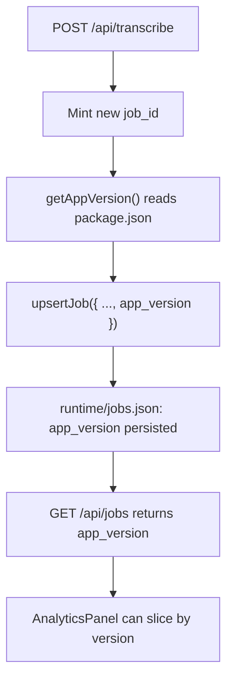

# Future Task: Stamp `app_version` on New Jobs (Analytics)

## Goal

Record the WeatherV1 app version that created each job, so usage / cost
analytics can be sliced by build. Primary purpose: analytics — correlate
spend, failure rates, and provider cost regressions with the release the
job was produced on. Not used for migrations, gating, or compatibility
shims.

- Every job created from this change forward carries an `app_version`
  string (e.g. `"0.3.13"`).
- Older jobs already in `runtime/jobs.json` are left as-is (`app_version`
  remains `undefined`). No backfill.
- The field flows through the existing `/api/jobs` response and into the
  in-app Analytics panel with no schema gymnastics.

## Research Summary

Findings from the current codebase (see file paths below):

- **`JobRecord` shape** lives in `src/server/jobs/store.ts:25-36` and is
  validated by the Zod schema in `src/server/jobs/schema.ts:15-24`. The
  schema strips unknown fields on read, so any new field has to be added
  in both places to round-trip safely.
- **Job creation is funnelled through one place**:
  `src/app/api/transcribe/route.ts:60-66` calls `upsertJob({ job_id,
  status: "draft", audio_filename, created_at })`. This is the only
  spot a fresh job-id is minted. `/api/render` (`src/app/api/render/route.ts:34`)
  also calls `upsertJob` but on an existing id; because `upsertJob`
  merges `{ ...prior, ...record }` (`store.ts:176`), a value set at
  transcribe time is preserved across the render upsert.
- **No runtime app-version helper exists today.** `package.json`
  (`version: 0.3.12`) is the only source. Electron's main process
  exposes `app.getVersion()` to the renderer via the desktop bridge
  (`electron/main.cjs:325`), but the Next server has no equivalent. A
  thin `src/server/runtime/app-version.ts` that imports `package.json`
  (`resolveJsonModule: true` is already on) gives us a single import
  point that works in both web and desktop runtimes.
- **`/api/jobs` returns the full record.** `src/app/api/jobs/route.ts`
  shapes a response that already includes `usage_summary` and
  `usage_calls`; an additional optional field requires no API change.
- **Analytics panel** at
  `src/client/components/jobs/AnalyticsPanel.tsx` already aggregates
  `usage_summary` by day and by LLM model/provider. Adding a "by
  version" rollup or filter is straightforward but explicitly out of
  scope for the first ship.
- **No runtime-kind field on jobs.** Desktop vs. web is determined per
  request via `isDesktopMode()`
  (`src/server/runtime/auth.ts`) and never written to job metadata.
  Tracking that is a separate decision (see _Non-goals_).

## Proposed Behavior



Behavioural notes:

- `app_version` is stamped exactly once, at first creation. Subsequent
  status transitions (`draft → queued → processing → completed`) do not
  rewrite it.
- Re-rendering an old job in a newer app build does **not** change its
  `app_version` — the field reflects the version that minted the job,
  not the latest run.
- Older job records with no `app_version` render as "unknown" in any
  future analytics rollup; they are not retroactively patched.
- R2 mirroring of `jobs.json` already covers any field on the record, so
  no sync change is required.

## Implementation Plan

1. **Schema + type.**
   - `src/server/jobs/store.ts`: add `app_version?: string;` to
     `JobRecord`.
   - `src/server/jobs/schema.ts`: add
     `app_version: z.string().optional()` to `JobRecordSchema`.
2. **Runtime helper.**
   - New file `src/server/runtime/app-version.ts`:
     ```ts
     import pkg from "../../../package.json";
     export function getAppVersion(): string {
       return pkg.version;
     }
     ```
   - Single import point; trivial to mock in tests if needed later.
3. **Stamp at creation.**
   - `src/app/api/transcribe/route.ts`: import `getAppVersion` and add
     `app_version: getAppVersion()` to the `upsertJob` payload at
     line ~61.
   - Do **not** touch `/api/render`'s `upsertJob` — the merge in
     `upsertJob` preserves `prior.app_version` already.
4. **(Optional, follow-up)** Surface in analytics. Add a "by version"
   bucket in `AnalyticsPanel.tsx` alongside the existing
   day / model / provider rollups. Defer until the first user actually
   asks to filter by it; the data is already there.

## Verification

- `npx tsc --noEmit` (type check passes with the new schema field).
- `npm test` — add a small unit test that
  `upsertJob({ ..., app_version: "x.y.z" })` round-trips through
  `JobsFileSchema` and lands in `jobs.json` (extend
  `src/test/jobs-store-locking.test.ts` or add a sibling test).
- Manual: start `npm run dev`, upload an audio file, inspect
  `runtime/jobs.json` and confirm the new job has
  `"app_version": "0.3.12"` (or whatever `package.json` reports).
- Manual regression: delete `app_version` from an existing job in
  `runtime/jobs.json` by hand, reload `/api/jobs`, confirm the response
  still parses and the job appears without the field.

## Non-goals

- **No backfill.** Existing jobs stay as-is. If we ever want a historic
  view we can run a one-shot migration; not worth doing speculatively.
- **No runtime-kind field.** Desktop vs. web is orthogonal. If we want
  to slice analytics by it later, add a separate `runtime_kind:
  "desktop" | "web"` field; don't overload `app_version`.
- **No telemetry export.** This is local analytics only. No new network
  calls, no third-party analytics SDK.
- **No version-gating of features** based on the recorded value.
  Backwards-compatibility and migrations should continue to be driven
  by schema shape, not by reading `app_version`.

## Risks

- `package.json` import path is fragile if files move; the helper
  centralizes it so any breakage is one fix in one place.
- In the Next standalone build (`output: "standalone"`), `package.json`
  is included in the server bundle, so the import resolves at runtime.
  Worth a sanity check after `npm run build` the first time the helper
  ships.
